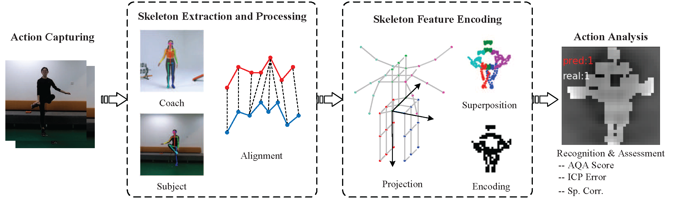

<!DOCTYPE html PUBLIC "-//W3C//DTD HTML 4.0//EN">
<html><head><meta http-equiv="Content-Type" content="text/html; charset=UTF-8">
	<!-- 支持中文 -->
	
<title>Jianwei Li's Homepage</title>

<!--  -->

</head>

<body>
	

	

	<table id="personal_info">
	<tbody><tr>
	<td></td>
	<td>
	

		<h1>Jianwei Li</h1>
		jianwei@bsu.edu.cn  
		<!-- <a href="https://scholar.google.com/citations?user=htu3c7wAAAAJ">Google Scholar</a> / -->
		<!-- <a href="https://www.researchgate.net/profile/Gu_Wang">Research Gate</a>  / -->
		<!-- <a href="https://github.com/wangg12">GitHub</a>  -->
	
 
	</td>
	</tr>
	</tbody></table>

	<h2>About Me</h2>
	I am a teacher in AI Lab, School of Sports Engineering, Beijing Sports University. My research interests are 3D computer vision and artificial intelligence in sports.
	

	

<!-- 
 -->

<h2>Education and Experience</h2>
<li>[07/2015-07/2019] Ph.D. student, in State key laboratory of pattern recognition, Institute of Automation, University of Chinese Academy of Sciences.</li> 
<li>[05/2012-05/2015] National Science Library，Chinese Academy of Sciences.</li> 
<li>[08/2011-05/2012] Schneider Electric SA.</li> 
<li>[09/2004-07/2011] B.E. & M.D.,Beijing Jiaotong University.</li> 

<h2>主讲课程</h2>
<li>人工智能原理与实践/Artificial Intelligence Theory and Practice (研究生课程)</li> 
<li>计算机视觉/ Computer Vision (本科生课程)</li> 
<li>机器学习/Machine Learning (本科生课程)</li> 
<li>数字图像处理/ Digital Image Processing (本科生课程)</li> 

<h2>科研项目</h2>
<li>2021年-至今：主持模式识别国家重点实验室开放课题“基于多视立体视觉的运动场景三维重建关键技术研究”</li> 
<li>2021年-至今：主持中央高校基本科研业务费专项资金资助团队课题“基于体育视频的人体运动智能捕捉技术研究”</li> 
<li>2020年：主持疫情防控应急专项课题“基于人体骨架信息的隔离环境下VR减压运动评估技术研究”，设计VR智能化健身系统框架， 
    &nbsp;&nbsp;&nbsp;&nbsp;研究基于计算机视觉技术的人体运动智能化分析算法</li> 
<li>2020年：主持中央高校基本科研业务费专项资金资助课题“室内运动场景三维重建技术研究”，研究基于语义分析的室内动态环境三维重建算法</li> 
<li>2021年-至今：参与国家重点项目科技冬奥子课题“冰雪头盔的视域和认知功能测试技术与设备”</li> 
<li>2020年-至今：参与华为横向课题“科学健身二期技术咨询项目”，完成基于视觉技术的动作质量评估算法</li> 
<li>2016-2019年：参与国家重点研发计划“室内混合智能定位于室内GIS技术研究及示范应用”之课题二“室内地标特征匹配与位姿精密估计”， 
&nbsp;&nbsp;&nbsp;&nbsp;研究基于RGB-D图像的室内场景建模与定位算法</li> 
<li>2012-2015年：参与“十二五”科技支撑计划项目“面向外文科技文献信息的知识组织体系建设与应用示范(STKOS)”子项目 
&nbsp;&nbsp;&nbsp;&nbsp;“面向外文科技文献的超级科技词表和本体建设”，负责科研本体知识库平台建设</li> 
<li>2012-2015年：参与“中科院研究所群组集成知识平台可持续服务能力建设”，负责中科院专业领域知识环境建设</li> 

<!-- 

<h2>Teaching</h2>
<li><a href="xx">TODO</a> (Spring Term 2020) </li>
<li><a href="TODO">TODO</a> (Autumn Term 2019) </li>

 -->

<!-- 

<h2>Services</h2>
<li>TODO</li>
<li>TODO</li>

 -->

	

  <!-- 
	<h2>Publications</h2>

	

	For all publications please check my
	<a href="https://scholar.google.com/citations?user=htu3c7wAAAAJ">Google Scholar</a> and
	<a href="https://www.researchgate.net/profile/Gu_Wang">ResearchGate</a>.
	  
	-->
	<table class="pub_table"> 
  <!-- <tbody><tr><td class="sub_heading">Recent Selected Papers
</td></tr> -->
  <tbody><tr><td class="sub_heading">Publications</td></tr>

	<tr>
		<td class="pub_td1">
			

		</td>
		<td class="pub_td2"><b>High-quality indoor scene 3D reconstruction with RGB-D cameras: a brief review.</b> 
			<b>Jianwei Li</b>, Wei Gao, Yihong Wu, Yangdong Liu, Yanfei Shen. 
			<i>Computational Visual Media. 2021</i>. 
			[<a href="./paper/tmp.pdf">Paper</a>]
		</td>
	</tr>

	<tr>
		<td class="pub_td1">
			

		</td>
		<td class="pub_td2"><b>What and How Well You Exercised? An Efficient Analysis Framework for Fitness Actions</b> 
			<b>Jianwei Li</b>, Qingyue Hu, Tianxiao Guo, Siqi Wang, Yanfei Shen 
			<i>Journal of Visual Communication and Image Representation. 2021</i>. 
			[<a href="./paper/tmp.pdf">Paper</a>]
		</td>
	</tr>

	<tr>
		<td class="pub_td1">

</td>
		<td class="pub_td2"><b>Efficient Fitness Action Analysis Based on Spatio-temporal Feature Encoding</b> 
			<b>Jianwei Li</b>, Hainan Cui, Tianxiao Guo, Qingyue Hu, Yanfei Shen. 
		  <i>IEEE International Conference on Multimedia and Expo (AI-Sports Workshop), ICME, 2020</i>. 
		  [<a href="https://ieeexplore.ieee.org/document/9106049">Paper</a>]
	</td></tr>

  	<tr>
		<td class="pub_td1">

</td>
		<td class="pub_td2"><b>An Intelligent Analysis Method for Fitness Actions with a Mobile Camera</b> 
			<b>Jianwei Li</b>,Haiqing Hu, Kaiyu Zhang. 
		  <i>The 26th European College of Sport Science Congress,2021</i>. 
		  [<a href="https://ieeexplore.ieee.org/document/9106049">Paper</a>]
	</td></tr>
	
	<tr>
		<td class="pub_td1">

</td>
		<td class="pub_td2"><b>Analysis of Emotion Regulation Effect by Home Exercise: A Case Study on Home Quarantine during COVID-19</b> 
			<b>Jianwei Li</b>,Fuwei Jiao. 
		  <i>The 25th European College of Sport Science Congress, Sevilla, Spain, Oct, 2020</i>. 
	</td></tr>
	
	<tr>
		<td class="pub_td1">

</td>
		<td class="pub_td2"><b>High-quality 3D Reconstruction with Depth Super-resolution and Completion</b> 
			<b>Jianwei Li</b>, Wei Gao, Yihong Wu. 
		  <i>IEEE Access, 2019, 7(1): 19370-19381</i>. 
		  [<a href="https://ieeexplore.ieee.org/document/8628990">Paper</a>]
	</td></tr>
	
	<tr>
		<td class="pub_td1">

</td>
		<td class="pub_td2"><b>Robust and Efficient CPU-based RGB-D Scene Reconstruction</b> 
			<b>Jianwei Li</b>, Wei Gao, Heping Li, Fulin Tang, Yihong Wu. 
		  <i> Sensors, 2018, 18(11): 3652-3667</i>. 
		  [<a href="https://www.mdpi.com/1424-8220/18/11/3652">Paper</a>]
	</td></tr>
	
	<tr>
		<td class="pub_td1">

</td>
		<td class="pub_td2"><b>Elaborate Scene Reconstruction with a Consumer Depth Camera</b> 
			<b>Jianwei Li</b>, Wei Gao, Yihong Wu. 
		  <i> International Journal of Automation and Computing, 2018,15(4): 443-453</i>. 
		  [<a href="http://www.ijac.net/en/article/doi/10.1007/s11633-018-1114-2">Paper</a>]
	</td></tr>

	</tbody></table>

	

	

	

		<h2>Patents</h2>
		<!-- <ul> -->
		<li> 李建伟,郭天晓,沈燕飞,胡庆锐. 一种运动分析方法、装置、设备和存储介质 [P].中国:202010542967.8.</li> 
		<li> 李建伟,高伟,吴毅红.基于深度相机进行室内完整场景三维重建的方法及系统[P].中国:CN201710051366.5,2020-02-28.</li> 
		<li> 李建伟,李和平,唐付林,高伟,吴毅红. 快速鲁棒的RGB-D三维重建方法[P].中国:201810213575.X,2020-09-01.</li> 
		<li> 李建伟,高伟,吴毅红. 一种用于三维重建的深度图超分辨率与补全方法及系统[P].中国:201910079993.9,2021-03-23.</li> 
		<li> 张开宇,李建伟,杨召阳,钱德省. 一种规范握力测试的方法及装置[P], 202011613390.1.</li> 
		<li>  张开宇,钱德省,田寅生,李建伟. 一种规范坐位体前屈测试的方法及装置[P], 202011642800.5.</li> 
		<!-- </ul> -->
		

		

</body></html>